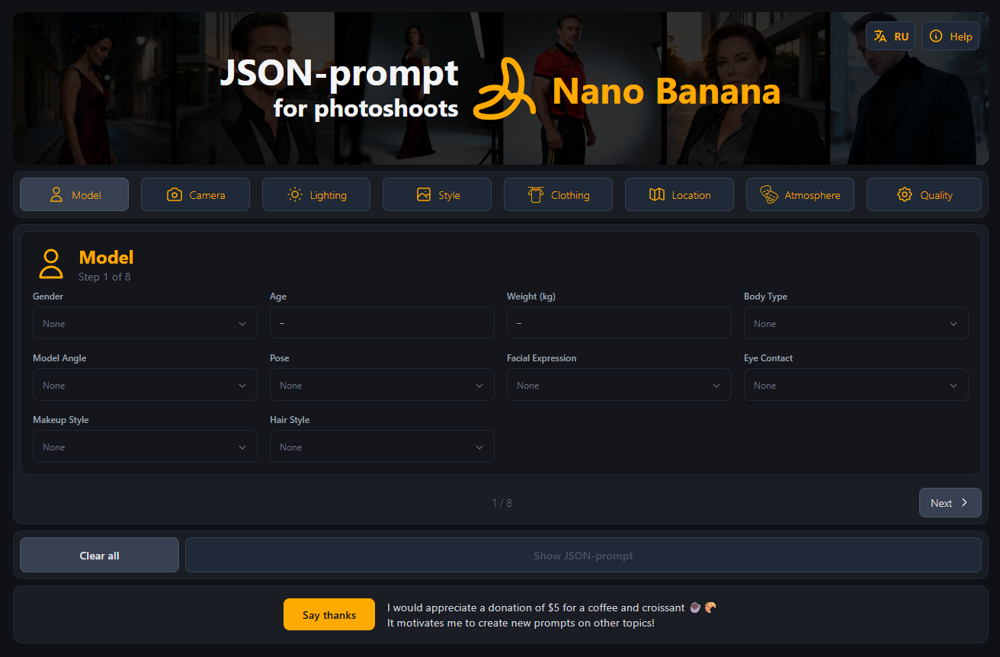

# Photoshoot JSON-prompt Generator

JSON-prompt generator for AI photoshoot creation, optimized for Nano Banana and other image generation neural networks.

🌐 **Live Demo:** [https://json-prompt-photoshoot.vercel.app/](https://json-prompt-photoshoot.vercel.app/)

## Demo

[📹 Watch demo video](.github/images/video_.mp4)



## Features

- 📸 8 categories of parameters (Model, Camera, Lighting, Style, Clothing, Location, Atmosphere, Quality)
- 🌐 Bilingual interface (Russian/English)
- 🎨 Color palette selector for clothing
- 📋 One-click JSON prompt copy
- 🔄 Auto-translation to English (powered by Google Translate)
- 💡 Built-in help modal
- 🚀 Fully client-side - no backend required!

## Tech Stack

- React 18
- Vite
- Tailwind CSS
- React Colorful
- Google Translate API (client-side)

## Installation

```bash
cd client
npm install
npm run dev
```

## Usage

1. Select parameters from each category (or enter custom values)
2. Text in Russian is automatically translated to English
3. Click "Show JSON-prompt" button
4. Copy the generated JSON prompt
5. Use it in your AI image generator (Nano Banana, Stable Diffusion, etc.)

## Deployment

The app is fully static and can be deployed to any hosting:

### Vercel (recommended)
```bash
cd client
npm run build
```
- Build command: `npm run build`
- Output directory: `dist`
- Auto-deploys from GitHub

### Other platforms
- Netlify
- GitHub Pages
- Cloudflare Pages
- Any static hosting

## License

MIT
